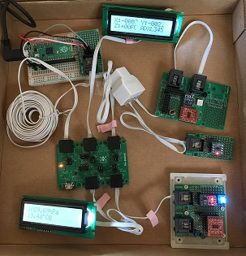

## Welcome to Modulio ::  Modular I/O system based on the I2C bus

Modulio is flexible generic I/O sysytem based on I2C-bus and RJ11(6P4C) modular cable.
It is so easy for you to plug-in/out the cable, to change connection, and to add/remove
modules, thus Modulio is very convenient for prototyping and education.
Modulio libraries provides common APIs that does not depend on microcontroller/platform.
These are written in 'C' language and has a hierarchical structure. Thus, it is easy to 
move Modulio Library to different platform and user applications can work on various 
microprocessor/platforms only to re-compile. If you want to port it to your favorite 
microcontroller, all you have to do is to impliment basic I2C bus access functions. Actually, I 
could port Modulio Library to Cypress PSoC1 (CY8C29466, CY8C27143 ） Microchip 
PIC24F08 & ATMega328P, RaspberryPi , RaspberryPi Pico
Modulio supports up to eight PCA9546A 4channnel I2C bus switch. The bus switch allows 
multiple devices with same I2C bus address to be used.
Moudlio also suggests standard PCB sizes.

[Modulio Document](./Modulio.pdf)  

